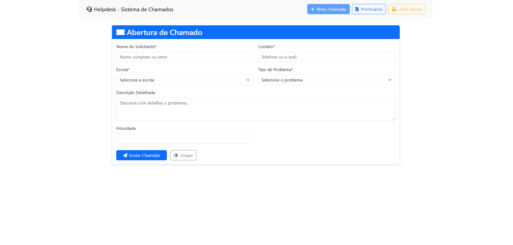
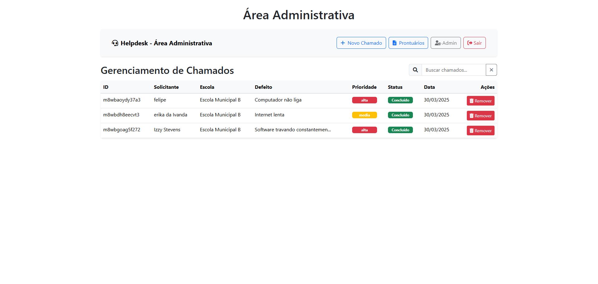
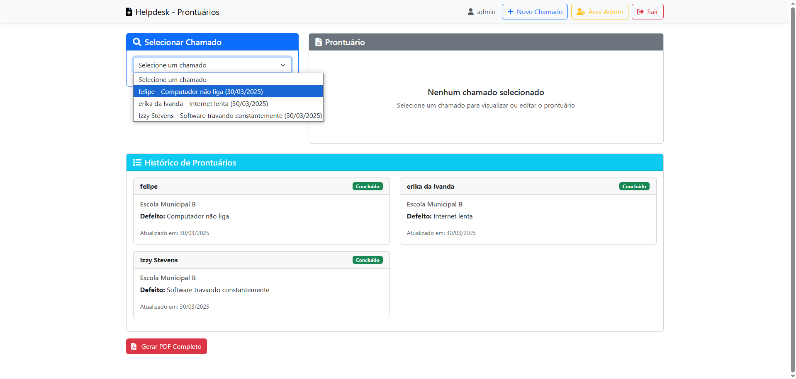

# **Sistema de Helpdesk**
#### Este é um sistema de Helpdesk desenvolvido utilizando HTML, CSS, JavaScript e Bootstrap, projetado para auxiliar no gerenciamento de chamados de suporte técnico. O sistema permite adicionar chamados, visualizar prontuários e gerar relatórios em PDF.

[Ir ao Helpdesk]()

# 📌 Funcionalidades

- Adicionar Chamado: Permite registrar novos chamados com informações detalhadas sobre o problema.

- Olhar Prontuários: Consulta histórico de chamados e registros de ações realizadas.

- Gerar Relatórios em PDF: Possibilita a exportação de dados dos chamados em formato PDF para análise e arquivamento.
#

# 🛠️ Tecnologias Utilizadas

- 
- 
- 
- 
#

# 📌 Exemplo de Uso

- Acesse a página inicial do sistema.

- Clique em "Enviar Chamado" e preencha as informações necessárias.

- Acesse a seção de Prontuários para consultar chamados anteriores.

- Gere um Relatório em PDF para documentar as ocorrências registradas.

# 🛠️ Contribuição

- Se desejar contribuir com melhorias para o sistema, siga estes passos:

- Faça um fork do repositório.

- Crie uma branch para sua melhoria (git checkout -b minha-melhoria).

- Realize suas alterações e commit (git commit -m 'Melhoria implementada').

- Envie um pull request.

#
- Este projeto está sob a licença MIT. Sinta-se à vontade para utilizar e modificar conforme necessário.

# 
# **Obrigado! 😎😁**
